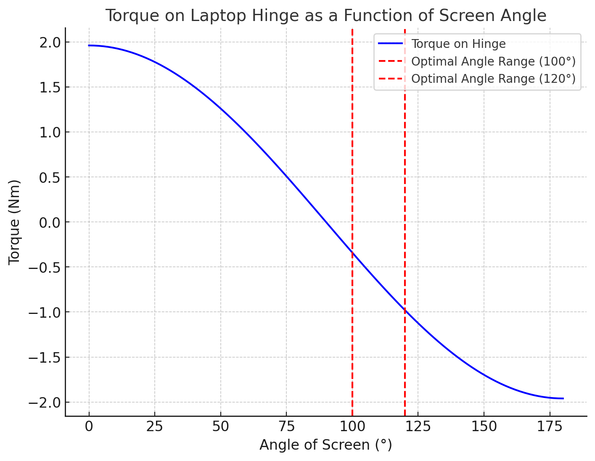

# 4. Best Angle for Resting a Laptop

When using a laptop, we often adjust the screen for comfort, but have you ever wondered about the angle that minimizes strain on the laptop's hinges? The torque (rotational force) applied to the hinges is an important factor, and it increases as the screen is tilted. Here's a breakdown of the best angle to keep your laptop screen for minimum pressure on the hinge.

Torque on Laptop Hinges
The torque (𝜏) acting on the hinge is determined by the following equation:

<code>τ=F⋅d⋅cos(θ)</code>
Where:

- 𝐹 is the force acting on the screen (weight of the screen),
- 𝑑 is the distance from the hinge to the center of mass of the screen,
- θ is the angle of the screen from the base.

As the screen angle increases from 0° (closed) to 180° (fully open), the torque increases, which could lead to increased wear on the hinges.

# Optimal Angle Range

Based on my torque calculations, the optimal range for minimal torque (and thus reduced strain on the hinge) is between 100° and 120°. This range strikes a balance between usability and hinge protection.



# Conclusion

By keeping your laptop screen between 100° and 120°, you can minimize the torque on the hinge and extend its lifespan. A little attention to the angle not only improves comfort but also ensures the longevity of your laptop!

# Code

```
import matplotlib.pyplot as plt
import numpy as np

# Constants (assumed)

screen_mass = 1 # mass of screen in kg
g = 9.8 # gravitational acceleration in m/s^2
force = screen_mass \* g # force acting on the screen in Newtons

# Distance from hinge to the center of mass (approximate)

d = 0.2 # in meters

# Angles (in degrees)

angles_deg = np.linspace(0, 180, 100)
angles_rad = np.radians(angles_deg) # convert to radians

# Torque calculation (torque = force _ distance _ cos(angle))

torque = force _ d _ np.cos(angles_rad)


plt.figure(figsize=(8, 6))
plt.plot(angles_deg, torque, label="Torque on Hinge", color='b')
plt.axvline(x=100, color='r', linestyle='--', label="Optimal Angle Range (100°)")
plt.axvline(x=120, color='r', linestyle='--', label="Optimal Angle Range (120°)")

plt.title("Torque on Laptop Hinge as a Function of Screen Angle", fontsize=14)
plt.xlabel("Angle of Screen (°)", fontsize=12)
plt.ylabel("Torque (Nm)", fontsize=12)
plt.legend(loc='upper right')
plt.grid(True)
plt.show()

```
