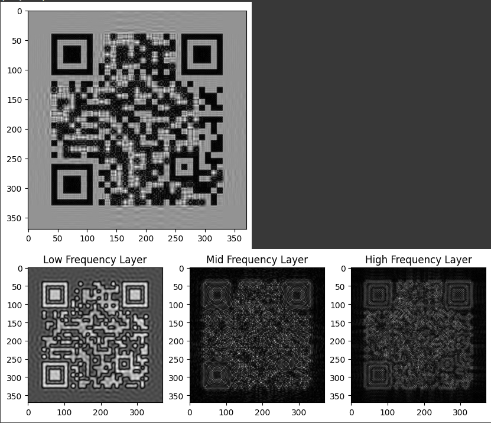

# 5. Fourier-Transformed QR Codes & Encoding Information with Signal-Based Bits

A QR code is a type of two-dimensional matrix barcode, invented in 1994, by Japanese company Denso Wave (legendary for not patenting this invention) for labelling automobile parts.

Idea came forth while watching this video by the man, the myth, the legend, <a href='https://www.youtube.com/watch?v=w5ebcowAJD8'>Veritasium</a>.

# (First Section) Fourier-Transformed QR Codes

I Googled this but was unable to find any material on the subject. It seems that people have realized it's not efficient, but I couldn't find any implementations. Therefore, I decided to try it out myself.

## Introduction

QR codes are a widely used form of two-dimensional barcodes, primarily designed to store and encode data. The idea of embedding multiple layers of information into a single QR code opens up new possibilities for storing complex datasets. One such approach is to manipulate the frequency domain of the QR code using Fourier transforms, enabling us to combine multiple information layers into a single image.

In this article, we will explore how to use Fourier transforms to split a QR code into multiple frequency layers, manipulate those layers, and finally combine them back into a single image. We'll also explore how to sharpen the medium and high-frequency layers to enhance certain aspects of the QR code.

### Step 1: Fourier Transform of an Image

To manipulate the frequency components of an image, we need to convert the image from the spatial domain (pixel values) to the frequency domain. This is done using the Discrete Fourier Transform (DFT). The DFT converts an image into its frequency components, allowing us to isolate and manipulate different frequencies.

# Step 1: Fourier Transform of an Image

The **Discrete Fourier Transform (DFT)** of an image \( f(x, y) \) is defined as:

$$
F(u, v) = \sum_{x=0}^{M-1} \sum_{y=0}^{N-1} f(x, y) e^{-2 \pi i \left( \frac{ux}{M} + \frac{vy}{N} \right)}
$$

Where:

- \( f(x, y) \) is the pixel intensity at position \( (x, y) \).
- \( F(u, v) \) is the Fourier coefficient at frequency \( (u, v) \).
- \( M \) and \( N \) are the dimensions of the image.

The **Inverse Fourier Transform (IFT)** is defined as:

$$
f(x, y) = \frac{1}{M \cdot N} \sum_{u=0}^{M-1} \sum_{v=0}^{N-1} F(u, v) e^{2 \pi i \left( \frac{ux}{M} + \frac{vy}{N} \right)}
$$

# Step 2: Band-Pass Filtering

A **band-pass filter** allows frequencies within a specified range to pass through while blocking others. The filter is defined as:

$$
H(u, v) =
\begin{cases}
1 & \text{if } f_{\text{low}} \leq \sqrt{u^2 + v^2} \leq f_{\text{high}} \\
0 & \text{otherwise}
\end{cases}
$$

Where:

- high and low are the frequency bounds.

# Step 3: Sharpening the Medium and High-Frequency Layers

To sharpen specific frequency layers, we increase their magnitudes by a factor \( G \):

$$
F_{\text{sharpened}}(u, v) = G \cdot F(u, v)
$$

Where \( G \) is the sharpening gain factor (greater than 1 for sharpening).

# Step 4: Combining the Frequency Layers

After sharpening, the frequency layers are summed to obtain the final combined frequency image:

$$
F_{\text{combined}}(u, v) = F_{\text{low}}(u, v) + F_{\text{medium}}(u, v) + F_{\text{high}}(u, v)
$$

# Step 5: Inverse Fourier Transform

We apply the **Inverse Fourier Transform (IFT)** to the combined frequency image to return to the spatial domain:

$$
f(x, y) = \frac{1}{M \cdot N} \sum_{u=0}^{M-1} \sum_{v=0}^{N-1} F(u, v) e^{2 \pi i \left( \frac{ux}{M} + \frac{vy}{N} \right)}
$$

# Conclusion

In this approach, we attempted to combine multiple layers of information into a single QR code by using frequency-domain manipulation. By leveraging the **Fourier Transform**, we aimed to isolate and sharpen different frequency ranges corresponding to low, medium, and high frequencies, with the ultimate goal of encoding multiple data layers in a single QR code.

We used **band-pass filters** to isolate different frequency bands and then recombined the layers to form a multi-layer QR code. Each of these frequency layers was sharpened to enhance its contribution to the final image. Afterward, we applied the **Inverse Fourier Transform** to return to the spatial domain, aiming to generate the final, multi-layered QR code.

While the theory is sound, and the process works well in controlled environments (e.g., images with distinct frequency components), several challenges arise when applying this method to real-world data such as to QR codes.

## Why It DOES Not Work in Real Time

1. **Frequency Domain Characteristics**: QR codes have highly structured, repetitive patterns (e.g., finder and alignment patterns) that don’t separate cleanly into distinct frequency bands. This can lead to the low-frequency layer dominating, with higher frequencies (carrying additional data) becoming lost or indistinguishable.

2. **Sharpness of Frequency Layers**: Over-sharpening medium and high-frequency layers can distort them, causing artifacts and making the QR code unreadable. The sharpening factor needs to be carefully controlled to avoid this issue.

3. **Filter Ranges**: The band-pass filter ranges used may not be optimal for QR codes, which have a defined structure. Too wide or too narrow ranges may fail to isolate the relevant data from noise.

4. **Loss of Information**: The Fourier Transform introduces subtle losses due to rounding errors, aliasing, or insufficient resolution, leading to information loss.

5. **Reconstruction Challenges**: Manipulating frequency layers and performing inverse transforms can result in errors, causing the reconstructed QR code to become noisy or distorted, making it difficult to decode properly.

## Implementation

Implementing a Fourier Transformed QR Code can lead to data loss and may not perform as expected. In my example implementation, I was able to retrieve data from the low-frequency layer, but the data from the middle and high-frequency layers remained indecipherable. Although sharpening the image and other adjustments may help, recovering the full data remains inefficient.

Another effective approach is to use multi-color bits to encode information. This method can significantly increase the data storage capacity of a QR code. Multi-color QR codes work well in controlled environments with precise camera positioning but aren't widely popular due to the need for precise color detection at the bit level.

# (Mini Section) Rethinking QR Codes: Encoding Information with Signal-Based Bits

## Introduction

This part of the article explores a theoretical approach where each bit pattern encodes distinct signals, resulting in a multi-layered QR code that can reveal complex information progressively based on scan duration.

## Bit Pattern to Signal Mapping

1. **Cosine Signal (`1001011`)**

   - **Purpose**: Stores static, baseline data (e.g., QR code version, metadata).
   - **Info Derived**: Basic, essential data; interpretable with short scans.

2. **Sine Signal (`1001010`)**

   - **Purpose**: Holds primary content (e.g., URLs, contact details).
   - **Info Derived**: Smooth, continuous data like text; accessible in quick scans.

3. **Logarithmic Signal (`1100110`)**

   - **Purpose**: Encodes metadata or time-based data (e.g., expiration info).
   - **Info Derived**: Time-sensitive parameters; accessible with longer scans.

4. **Exponential Signal (`1010101`)**

   - **Purpose**: Represents dynamic, session-based data.
   - **Info Derived**: Session-specific codes; allows data to change with time.

5. **Square Wave Signal (`1110001`)**
   - **Purpose**: Stores toggle data (on/off states).
   - **Info Derived**: Binary states, settings for interactive features.

## Time-Based Signal Combination

This system allows the QR code to reveal information progressively:

- **Short Scans**: Reveal low-frequency cosine and sine signals with essential data.
- **Moderate Scans**: Logarithmic and exponential signals add dynamic data like expiration and session-specific info.
- **Extended Scans**: Square wave signals reveal toggle states, unlocking interactive features.

## Applications

1. **Dynamic QR Codes**: QR codes that adapt based on scan duration, changing content as needed.
2. **Enhanced Security**: Session-based or time-limited information increases security.
3. **Rich Data Encoding**: Multi-layered data storage enables complex applications, from marketing to secure data transfers.

## Conclusion

By encoding each bit pattern as a unique signal, QR codes can move beyond binary to deliver richer, multi-dimensional data. This theoretical structure allows QR codes to convey information dynamically, making them powerful tools for the future of data encoding.
